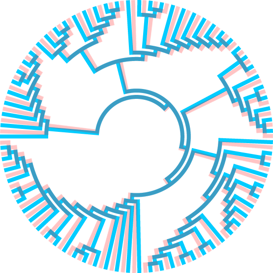

# Does morphology still matters in phylogenetics? 

## Summary

The impact of phenomic evidence on phylogenetic analyses dominated by DNA sequences

## Organization

This repository is organized as follows:
 
- Figures: Figures generated by R scripts

- R: Scripts, including the R Markdown

- Trees_extant: MOL + TE trees from MP and ML analyses, including only terminals with molecular data

- Trees_fossils: TE trees from MP and ML analyses including phenomic-only terminals

## Run analyses

To replicate analyses, run the each of the R scripts to calculate topological distances (script1\*R), bootstrap values between shared clades (script2\*R), and bootstrap values and occurrence of clades for logistic regressions (script3\*R). These scripts will generate results available at the CSV files. Then, run statistical analyses in AppendixS3_stats.Rmd.